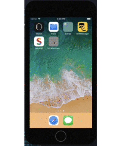

# WKWebView
## Description
Simple WKWebView App.  
You can check pure WKWebView and loading time of website.  

## App
|ScreenShot|Gif|
|:-:|:-:|
|||


## Branches
- develop
- feature/xcode8
- feature/xcode9

## Requirement
- feature/xcode8
    - Xcode8.3.3
    - Swift3

- develop or feature/xcode9
    - Xcode9.3
    - Swift4.1

## Install
```
$ git@github.com:yokurin/WKWebView.git
```

## Author
[Tsubasa Hayashi](https://github.com/yokurin)
